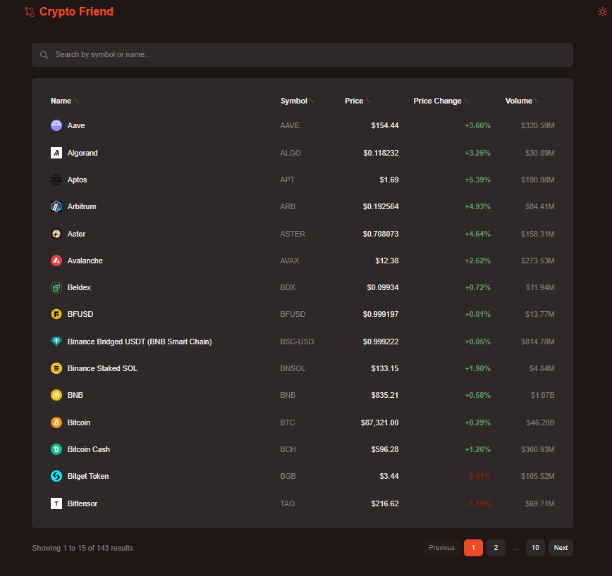
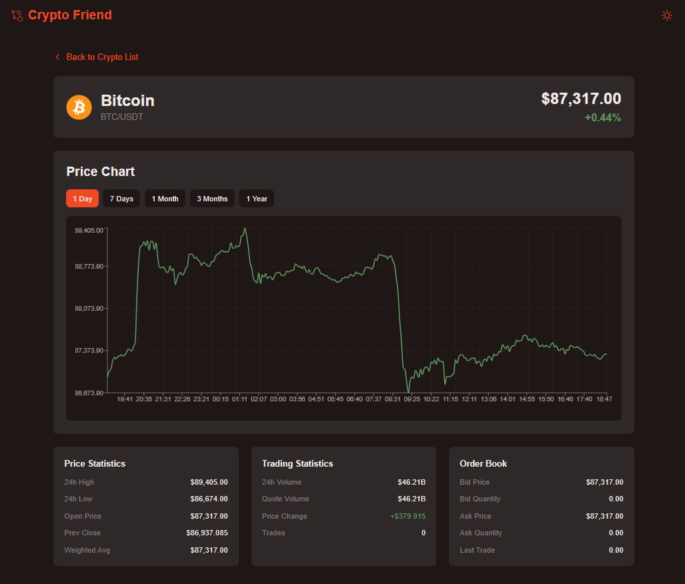

<div align="center">

# 🪙 Crypto Friend

**Your trusted companion for cryptocurrency market tracking and analysis**

[](https://nextjs.org/)
[](https://react.dev/)
[](https://www.typescriptlang.org/)
[](https://tailwindcss.com/)
[](https://www.coingecko.com/en/api)

*Make better investment and trading decisions with real-time cryptocurrency data*

</div>

---

## 📋 Table of Contents

- [Overview](#-overview)
- [Features](#-features)
- [Demo](#-demo)
- [Installation](#-installation)
- [Usage](#-usage)
- [Tech Stack](#-tech-stack)
- [Dev Explanation](#-dev-explanation)

---

## 🎯 Overview

**Crypto Friend** is a modern, responsive web application built with Next.js that provides comprehensive cryptocurrency market data, real-time price tracking, interactive charts, and detailed coin analytics. Whether you're a seasoned trader or a crypto enthusiast, Crypto Friend helps you make informed investment decisions.

### Key Highlights

- 📊 **Real-time Market Data** - Live cryptocurrency prices and market statistics
- 📈 **Interactive Charts** - Visualize price trends with customizable time intervals
- 🔍 **Advanced Search** - Quickly find coins by name or symbol
- 📱 **Fully Responsive** - Seamless experience across all devices
- 🌓 **Dark/Light Theme** - Customizable theme with smooth transitions
- ⚡ **Fast Performance** - Optimized with Next.js App Router and ISR

---

## ✨ Features

### 🏠 Home Page
- **Hero Section** - Engaging landing page with call-to-action
- **Navigation** - Easy access to all sections (Home, About, Contact)

### 📊 Cryptocurrency Market Table
- ✅ **150+ Coins** - Track top cryptocurrencies by market cap
- ✅ **Real-time Prices** - Updated every 60 seconds
- ✅ **Price Changes** - 24h price change percentage with color coding
- ✅ **Volume Tracking** - Trading volume statistics
- ✅ **Advanced Sorting** - Sort by name, symbol, price, change, or volume
- ✅ **Smart Search** - Filter coins by name or symbol
- ✅ **Pagination** - Navigate through 10 pages of 15 coins each
- ✅ **Mobile Optimized** - Responsive 2-column layout for mobile devices

### 💎 Coin Detail Pages
- ✅ **Detailed Statistics** - Comprehensive coin information
- ✅ **Price Charts** - Interactive charts with multiple time intervals:
  - 1 Day (hourly)
  - 7 Days (daily)
  - 1 Month (daily)
  - 3 Months (daily)
  - 1 Year (weekly)
- ✅ **Price Statistics** - High, low, open, close, weighted average
- ✅ **Trading Statistics** - Volume, quote volume, price change
- ✅ **Order Book Data** - Bid/ask prices and quantities

### 🎨 User Experience
- ✅ **Theme Toggle** - Switch between light and dark modes
- ✅ **Error Handling** - User-friendly error pages for missing coins
- ✅ **Loading States** - Smooth loading indicators
- ✅ **Responsive Design** - Works perfectly on desktop, tablet, and mobile

---

## 🎬 Demo

### Screenshots






### Live Demo

🚀 - [https://crypto-friend-five.vercel.app/](https://crypto-friend-five.vercel.app/)

---

## 🚀 Installation

### Prerequisites

- **Node.js** 18.17 or later
- **npm**

### Step 1: Clone the Repository

```bash
git clone https://github.com/yourusername/crypto-friend.git
cd crypto-friend
```

### Step 2: Install Dependencies

```bash
npm install
```

### Step 3: Run Development Server

```bash
npm run dev
```

### Step 4: Open in Browser

Open [http://localhost:3000](http://localhost:3000) to see the application.

---

## 🛠 Tech Stack

### Frontend
- **[Next.js 16.1](https://nextjs.org/)** - React framework with App Router
- **[React 19.2](https://react.dev/)** - UI library
- **[TypeScript 5.0](https://www.typescriptlang.org/)** - Type safety
- **[Tailwind CSS 4.0](https://tailwindcss.com/)** - Utility-first CSS framework

### Data Visualization
- **[Recharts](https://recharts.org/)** - Composable charting library

### APIs
- **[CoinGecko API](https://www.coingecko.com/en/api)** - Cryptocurrency market data

---

## 📋 Dev Explanation

## Explanation:
- There is an API Route to get the details for the chart (/api/crypto/[symbol]/klines/route.ts) which is being used by component ChartWithIntervals
The rest of the API calls are being done directly by Server Components

- I have the following folders as well
about: to have about route (accessible from footer)
contact: to have contact route (accessible from footer)
crypto: to access table (/crypto) and coin details (/crypto/[symbol])
assets: to have items for UI (so far only SVG icons)
components: to have miscellaneous components
contexts: to keep context for state management (so far only with Theme Context)
types/ui: to keep types used across different components
utils: to keep general functions used across different components

- Chart: There is a line chart built with recharts library, I chose it because it is React first, really simple and friendly library and it is really efficient.
- State: I only used it for theme with React Context API since it is a small load of information being handled, the records for the crypto coins is cached and refreshed every minute
- CoinGecko API is being used since Binance API was returning 451 code


## AI Usage
- Dummy data: used to create about and contact pages, svg icon creation
- Investigation: Investigation with Binance 451 code issue
- Suggestions: Asking suggestions about coloring, styles and information

## Design decisions
- I wanted to be super easy and simple to use, as if it was for someone that have never seen a crypto coins app
- For the table page I added just the table with the most important details and the filter/search bar
- For the details page I was based in Binance API, but I made it simpler by adding just the vital elements and the nav buttons for the chart, so the user could see the behaviour of the coin in the market.

## Challenges & Trade-offs:
I had an issue with Binance API, I was getting a 451 code, I researched and it looks it is an issue with request coming from vercel domain, so I decided to use Coin Gecko
I also had an issue with this new API, once getting the records and filtering out it looks like I was getting duplicated elements, but it was because the Coin Gecko returns some coins with the same symbol, so I just added a conditional right after getting the records.

## Opportunity Areas:
If I have more time I would:
- Add conversion calculation capabilities
- Add accessibility labels
- Add a quiz to know the expectations of the user and being able to suggest best coins to invest in.
- Link it to an AI to process information obtained for it to suggest a good investment portfolio.
- Add unit testing to ensure quality
---

<div align="center">

**Made with ❤️ using Next.js and React**
</div>
