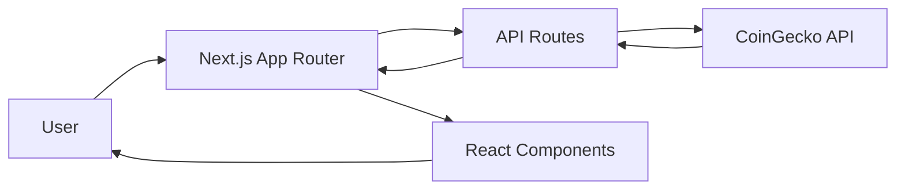

<div align="center">

# 🪙 Crypto Friend

**Your trusted companion for cryptocurrency market tracking and analysis**

[](https://nextjs.org/)
[](https://react.dev/)
[](https://www.typescriptlang.org/)
[](https://tailwindcss.com/)
[](https://www.coingecko.com/en/api)

*Make better investment and trading decisions with real-time cryptocurrency data*

[Features](#-features) • [Demo](#-demo) • [Installation](#-installation) • [Usage](#-usage) • [Tech Stack](#-tech-stack)

</div>

---

## 📋 Table of Contents

- [Overview](#-overview)
- [Features](#-features)
- [Demo](#-demo)
- [Installation](#-installation)
- [Usage](#-usage)
- [Tech Stack](#-tech-stack)
- [Project Structure](#-project-structure)
- [API Routes](#-api-routes)
- [Contributing](#-contributing)
- [License](#-license)

---

## 🎯 Overview

**Crypto Friend** is a modern, responsive web application built with Next.js that provides comprehensive cryptocurrency market data, real-time price tracking, interactive charts, and detailed coin analytics. Whether you're a seasoned trader or a crypto enthusiast, Crypto Friend helps you make informed investment decisions.

### Key Highlights

- 📊 **Real-time Market Data** - Live cryptocurrency prices and market statistics
- 📈 **Interactive Charts** - Visualize price trends with customizable time intervals
- 🔍 **Advanced Search** - Quickly find coins by name or symbol
- 📱 **Fully Responsive** - Seamless experience across all devices
- 🌓 **Dark/Light Theme** - Customizable theme with smooth transitions
- ⚡ **Fast Performance** - Optimized with Next.js App Router and ISR

---

## ✨ Features

### 🏠 Home Page
- **Hero Section** - Engaging landing page with call-to-action
- **Navigation** - Easy access to all sections (Home, About, Contact)

### 📊 Cryptocurrency Market Table
- ✅ **150+ Coins** - Track top cryptocurrencies by market cap
- ✅ **Real-time Prices** - Updated every 60 seconds
- ✅ **Price Changes** - 24h price change percentage with color coding
- ✅ **Volume Tracking** - Trading volume statistics
- ✅ **Advanced Sorting** - Sort by name, symbol, price, change, or volume
- ✅ **Smart Search** - Filter coins by name or symbol
- ✅ **Pagination** - Navigate through 10 pages of 15 coins each
- ✅ **Mobile Optimized** - Responsive 2-column layout for mobile devices

### 💎 Coin Detail Pages
- ✅ **Detailed Statistics** - Comprehensive coin information
- ✅ **Price Charts** - Interactive charts with multiple time intervals:
  - 1 Day (hourly)
  - 7 Days (daily)
  - 1 Month (daily)
  - 3 Months (daily)
  - 1 Year (weekly)
- ✅ **Price Statistics** - High, low, open, close, weighted average
- ✅ **Trading Statistics** - Volume, quote volume, price change
- ✅ **Order Book Data** - Bid/ask prices and quantities

### 🎨 User Experience
- ✅ **Theme Toggle** - Switch between light and dark modes
- ✅ **Error Handling** - User-friendly error pages for missing coins
- ✅ **Loading States** - Smooth loading indicators
- ✅ **Responsive Design** - Works perfectly on desktop, tablet, and mobile

---

## 🎬 Demo

### Screenshots

> **Note:** Add your screenshots here. You can create a `docs/images/` folder and reference them like:
> 
> ```markdown
> 
> 
> 
> ```

### Live Demo

🚀 [Deploy your app and add the live demo link here]

---

## 🚀 Installation

### Prerequisites

- **Node.js** 18.17 or later
- **npm**, **yarn**, **pnpm**, or **bun**

### Step 1: Clone the Repository

```bash
git clone https://github.com/yourusername/crypto-friend.git
cd crypto-friend
```

### Step 2: Install Dependencies

```bash
npm install
# or
yarn install
# or
pnpm install
# or
bun install
```

### Step 3: Run Development Server

```bash
npm run dev
# or
yarn dev
# or
pnpm dev
# or
bun dev
```

### Step 4: Open in Browser

Open [http://localhost:3000](http://localhost:3000) to see the application.

---

## 💻 Usage

### Development

```bash
# Start development server
npm run dev

# Build for production
npm run build

# Start production server
npm start

# Run linter
npm run lint
```

### Environment Variables

Currently, the app uses public CoinGecko API endpoints. If you need to add API keys in the future, create a `.env.local` file:

```env
NEXT_PUBLIC_BASE_URL=http://localhost:3000
# Add other environment variables as needed
```

---

## 🛠 Tech Stack

### Frontend
- **[Next.js 16.1](https://nextjs.org/)** - React framework with App Router
- **[React 19.2](https://react.dev/)** - UI library
- **[TypeScript 5.0](https://www.typescriptlang.org/)** - Type safety
- **[Tailwind CSS 4.0](https://tailwindcss.com/)** - Utility-first CSS framework

### Data Visualization
- **[Recharts](https://recharts.org/)** - Composable charting library

### APIs
- **[CoinGecko API](https://www.coingecko.com/en/api)** - Cryptocurrency market data

### Development Tools
- **ESLint** - Code linting
- **PostCSS** - CSS processing

---

## 📁 Project Structure

```
crypto-friend/
├── app/                      # Next.js App Router pages
│   ├── api/                  # API routes
│   │   └── crypto/
│   │       ├── markets/      # Markets endpoint
│   │       └── [symbol]/     # Coin details & klines
│   ├── crypto/               # Crypto pages
│   │   ├── [symbol]/         # Dynamic coin detail page
│   │   └── page.tsx          # Main crypto list page
│   ├── about/                # About page
│   ├── contact/              # Contact page
│   ├── layout.tsx            # Root layout
│   ├── page.tsx              # Home page
│   └── globals.css           # Global styles
├── components/               # React components
│   ├── CryptoTable.tsx       # Main crypto table
│   ├── PriceChart.tsx        # Chart component
│   ├── ChartWithIntervals.tsx # Chart with time controls
│   ├── Header.tsx            # Navigation header
│   └── Footer.tsx            # Footer component
├── assets/                   # Static assets
│   └── icons/                # SVG icon components
├── contexts/                 # React contexts
│   └── ThemeContext.tsx      # Theme management
├── types/                    # TypeScript types
│   ├── coin.ts               # Coin type definitions
│   └── ui.ts                 # UI type definitions
├── utils/                    # Utility functions
│   ├── coingecko.ts          # CoinGecko API helpers
│   └── format.ts             # Formatting utilities
└── public/                   # Public static files
```

---

## 🔌 API Routes

The application uses Next.js API routes to fetch cryptocurrency data:

### `/api/crypto/markets`
- **Method:** GET
- **Description:** Returns list of top 150 cryptocurrencies
- **Response:** Array of `Coin` objects

### `/api/crypto/[symbol]`
- **Method:** GET
- **Description:** Returns detailed information for a specific coin
- **Parameters:** `symbol` (e.g., "BTC", "ETH")
- **Response:** `CoinDetail` object

### `/api/crypto/[symbol]/klines`
- **Method:** GET
- **Description:** Returns historical price data (klines) for charting
- **Parameters:** 
  - `symbol` - Coin symbol
  - `days` (query param) - Number of days (1, 7, 30, 90, 365)
- **Response:** Array of `KlineData` tuples

---

## 📊 Data Flow



---

## 🎨 Theme System

Crypto Friend supports both light and dark themes:

- **Light Theme:** Clean, bright interface with blue accents
- **Dark Theme:** Easy on the eyes with orange/red accents
- **Auto-detection:** Respects system preferences
- **Manual Toggle:** Theme switcher in header

---

## 🤝 Contributing

Contributions are welcome! Please feel free to submit a Pull Request.

1. Fork the repository
2. Create your feature branch (`git checkout -b feature/AmazingFeature`)
3. Commit your changes (`git commit -m 'Add some AmazingFeature'`)
4. Push to the branch (`git push origin feature/AmazingFeature`)
5. Open a Pull Request

### Development Guidelines

- Follow TypeScript best practices
- Use Tailwind CSS for styling
- Ensure responsive design
- Add proper error handling
- Write clear commit messages

---

## 📝 License

This project is licensed under the MIT License - see the [LICENSE](LICENSE) file for details.

---

## 🙏 Acknowledgments

- [CoinGecko](https://www.coingecko.com/) for providing free cryptocurrency API
- [Next.js](https://nextjs.org/) team for the amazing framework
- [Recharts](https://recharts.org/) for the charting library
- All contributors and users of this project

---

## 📈 Project Statistics

```
📦 Dependencies: 5 main packages
📄 Components: 10+ React components
🎨 Icons: 10+ custom SVG icons
📱 Pages: 4 main pages + dynamic routes
🔌 API Routes: 3 endpoints
⚡ Performance: Optimized with ISR (60s revalidation)
```

---

<div align="center">

**Made with ❤️ using Next.js and React**

⭐ Star this repo if you find it helpful!

[Report Bug](https://github.com/yourusername/crypto-friend/issues) • [Request Feature](https://github.com/yourusername/crypto-friend/issues) • [Documentation](https://github.com/yourusername/crypto-friend/wiki)

</div>
